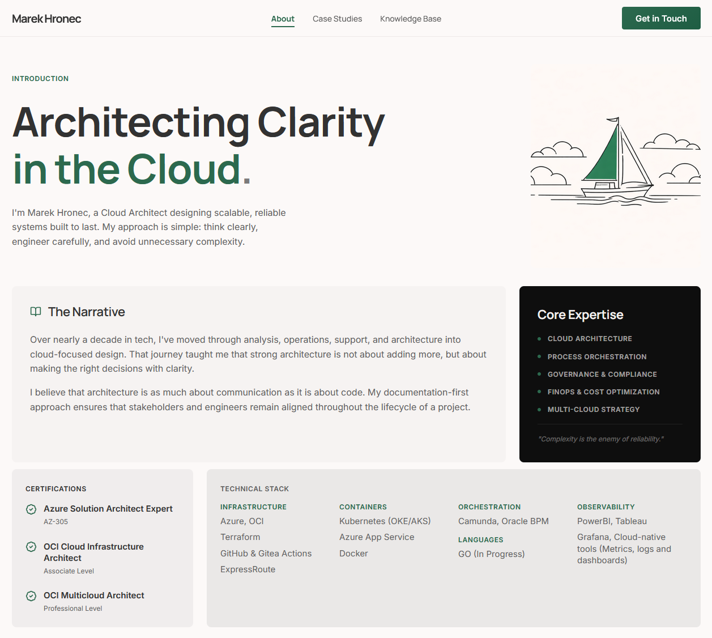
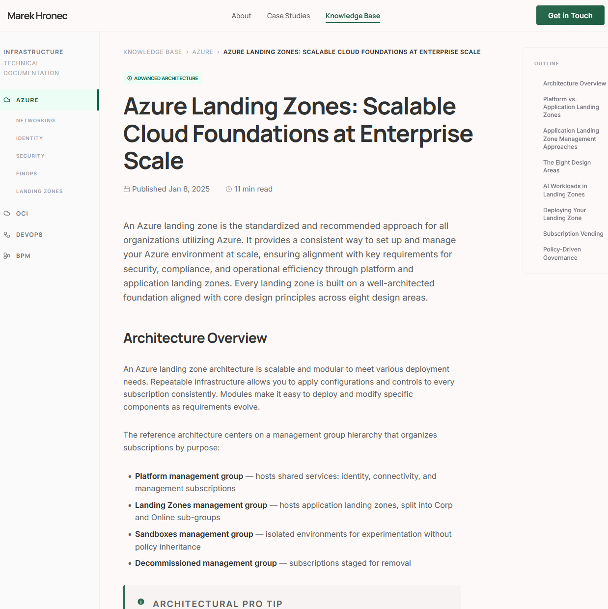

# Marek Hronec — Portfolio

Personal portfolio and technical knowledge base for a Senior Cloud Architect specialising in Azure, OCI, and cloud-native infrastructure.

[](https://www.marekhronec.com) [](https://github.com/MarekHronec/marek-hronec-web/actions/workflows/deploy.yml)

---

## Overview

This site serves two audiences: those evaluating technical background at a glance, and technical peers engaging with architecture writing in depth.

The design philosophy — "The Architectural Monograph" — treats the site as a curated technical journal rather than a product landing page. Layout is Swiss-grid inspired, typography is editorial, and visual weight comes from tonal layering rather than decoration.

The technical approach is equally intentional. Astro's static output mode means every page is pre-rendered HTML delivered directly from a CDN edge. Content Collections validate every article's frontmatter at build time using Zod schemas, eliminating the class of runtime errors that come from malformed markdown. Zero client-side JavaScript is shipped by default — the only script tag in production is the hamburger menu toggle.

| | |
|---|---|
|  |  |

---

## Tech Stack

| Layer | Technology | Version | Rationale |
|---|---|---|---|
| Framework | Astro | 6.1.3 | Zero JS by default; static output; TypeScript-first Content Collections. [Why not Next.js or Hugo →](docs/DECISIONS.md#adr-001-framework--astro-over-nextjs-and-hugo) |
| Language | TypeScript | 5.9.3 | Strict mode catches schema mismatches and missing props at build time. [→](docs/DECISIONS.md#adr-008-typescript--strict-mode) |
| Styling | Vanilla CSS + custom properties | — | Bespoke token system required for the editorial aesthetic; utility classes would fight the tonal layering design. [→](docs/DECISIONS.md#adr-002-styling--vanilla-css-with-custom-properties-over-tailwind-and-css-in-js) |
| Content | Markdown + Zod via Content Collections | — | Compile-time frontmatter validation with no CMS dependency. [→](docs/DECISIONS.md#adr-003-content--astro-content-collections-over-importmetaglob) |
| Fonts | Google Fonts CDN | — | Manrope (display), Inter (body), JetBrains Mono (code) — three fonts, three content roles. [→](docs/DECISIONS.md#adr-009-typography--manrope--inter--jetbrains-mono) |
| Sitemap | @astrojs/sitemap | 3.7.2 | Automatic sitemap generation on every build. |
| Deployment | GitHub Actions + GitHub Pages | — | Zero-cost static hosting on a custom domain; push to `main` deploys. [→](docs/DECISIONS.md#adr-007-deployment--github-pages-over-vercel-and-netlify) |

---

## Architecture at a Glance

```
Browser
  └── www.marekhronec.com (GitHub Pages CDN)
        └── Pre-rendered HTML + CSS
              └── Built by Astro from:
                    ├── src/pages/        ← file-based routing
                    ├── src/components/   ← .astro server components
                    ├── src/content/      ← Markdown + Zod schemas
                    └── src/styles/       ← CSS custom properties
```

**Component hierarchy:**

```
BaseLayout
├── Header (glassmorphism nav, hamburger menu)
├── <slot />
│   ├── index.astro           → HeroSection, NarrativeSection, CertsStackSection,
│   │                            ExperienceTimeline, CtaBanner
│   ├── case-studies/
│   │   ├── index.astro       → CaseStudyCard[], CaseStudyMetrics
│   │   └── [slug].astro      → CaseStudyMetrics, prose body
│   ├── knowledge-base/
│   │   ├── index.astro       → CategorySidebar, ArticleCard[]
│   │   └── [...slug].astro   → CategorySidebar, ArticleOutline (TOC), prose body
│   └── contact.astro         → ContactHero, ContactChannels, ContactServices
└── Footer
```

See [docs/ARCHITECTURE.md](docs/ARCHITECTURE.md) for the full technical deep-dive.

---

## Project Structure

```
.
├── .github/workflows/      # CI/CD — deploy.yml triggers on push to main
├── docs/                   # Project documentation
├── public/                 # Static assets: favicon, OG images
└── src/
    ├── components/
    │   ├── about/          # Hero, Narrative, Certs+Stack, Experience, CTA
    │   ├── case-studies/   # CaseStudyCard, CaseStudyMetrics
    │   ├── contact/        # ContactHero, ContactChannels, ContactServices
    │   ├── icons/          # Standalone SVG icon components
    │   ├── knowledge-base/ # CategorySidebar, ArticleCard, ArticleOutline
    │   └── layout/         # Header, Footer
    ├── content/
    │   ├── case-studies/   # *.md — validated by caseStudies Zod schema
    │   └── knowledge-base/ # **/*.md — validated by knowledgeBase Zod schema
    ├── layouts/
    │   └── BaseLayout.astro  # HTML shell, SEO meta, Open Graph
    ├── pages/                # File-based routes (see routing table below)
    ├── styles/
    │   ├── tokens.css        # All CSS custom properties — single source of truth
    │   └── global.css        # Reset, base typography, layout utilities
    └── content.config.ts     # Content Collections + Zod schema definitions
```

---

## Routing

| URL | File |
|---|---|
| `/` | `src/pages/index.astro` |
| `/case-studies` | `src/pages/case-studies/index.astro` |
| `/case-studies/:slug` | `src/pages/case-studies/[slug].astro` |
| `/knowledge-base` | `src/pages/knowledge-base/index.astro` |
| `/knowledge-base/:slug` | `src/pages/knowledge-base/[...slug].astro` |
| `/contact` | `src/pages/contact.astro` |

---

## Quick Start

```sh
git clone https://github.com/MarekHronec/marek-hronec-web.git
cd marek-hronec-web
npm install
npm run dev        # → localhost:4321
npm run build      # → dist/
npm run preview    # preview the production build locally
npx astro check    # TypeScript type-check
```

Node ≥ 22 required.

---

## Documentation

| Document | Contents |
|---|---|
| [docs/ARCHITECTURE.md](docs/ARCHITECTURE.md) | System design, component map, content model, CSS token reference, routing, deployment pipeline |
| [docs/DESIGN.md](docs/DESIGN.md) | Visual design philosophy — colour, typography, tonal layering, glassmorphism, spacing |
| [docs/DECISIONS.md](docs/DECISIONS.md) | Architecture Decision Records — every significant technical choice with context, options, and rationale |
| [docs/CONTENT_MODEL.md](docs/CONTENT_MODEL.md) | Content schemas, taxonomy, file organisation, how to add articles and case studies |
| [docs/DEVELOPMENT.md](docs/DEVELOPMENT.md) | Developer setup, project conventions, file naming, build process |

---

## License

MIT
