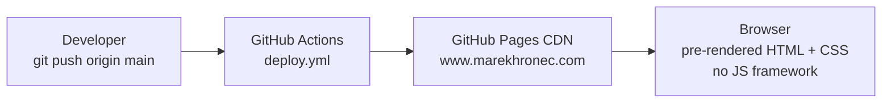
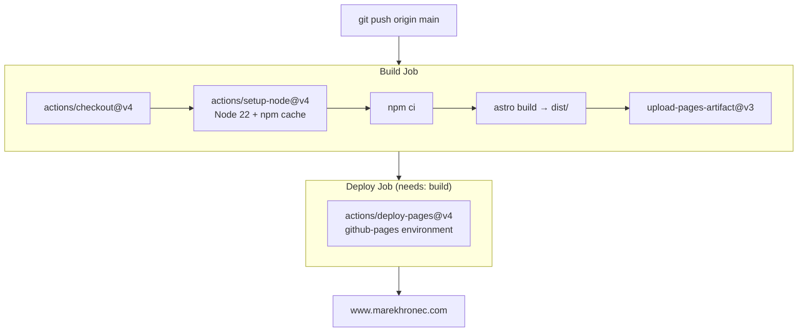

# Architecture

## Table of Contents

1. [System Overview](#1-system-overview)
2. [Tech Stack with Rationale](#2-tech-stack-with-rationale)
3. [Repository Structure](#3-repository-structure)
4. [Component Architecture](#4-component-architecture)
5. [Content Model](#5-content-model)
6. [Routing](#6-routing)
7. [Styling Architecture](#7-styling-architecture)
8. [Deployment Pipeline](#8-deployment-pipeline)
9. [Performance and Constraints](#9-performance-and-constraints)

---

## 1. System Overview

A personal portfolio and technical knowledge base deployed as a fully static site on GitHub Pages under a custom domain (`www.marekhronec.com`). Every page is pre-rendered to HTML at build time by Astro. No server runtime exists; the CDN delivers static files directly to the browser.

The key constraints that shaped every architectural decision:
- Output must be valid for GitHub Pages (static files only, no serverless functions)
- Zero client-side JavaScript shipped by default
- Content must be author-friendly Markdown with compile-time schema validation
- Visual quality must hold at the level of a senior architect's public-facing work



---

## 2. Tech Stack with Rationale

| Layer | Technology | Version |
|---|---|---|
| Framework | Astro | 6.1.3 |
| Language | TypeScript | 5.9.3 |
| Styling | Vanilla CSS + custom properties | — |
| Content | Markdown + Zod via Content Collections | — |
| Sitemap | @astrojs/sitemap | 3.7.2 |
| Fonts | Google Fonts CDN | — |
| Deployment | GitHub Actions + GitHub Pages | — |

The full decision trail for each choice — options considered, trade-offs, and consequences — is in [DECISIONS.md](DECISIONS.md).

### Astro over Next.js and Hugo

Next.js ships the React runtime and is optimised for applications with dynamic data fetching. A static portfolio has no use for hydration, client-side routing, or server components — the React overhead would add kilobytes with zero benefit. Hugo is faster at build time but uses Go templating, has no TypeScript support, and provides no schema validation for content files. Astro ships zero JS by default, exposes file-based routing identical in concept to both alternatives, and provides Content Collections — a typed, Zod-validated content layer — out of the box.

### Vanilla CSS over Tailwind and CSS-in-JS

The visual design system ("The Architectural Monograph") requires an editorial aesthetic with bespoke tonal layers, custom spacing rhythms, and glassmorphism scoped to two elements. Tailwind's utility-first approach would produce class stacks of 20+ tokens per element and fight the intent of the design system. CSS-in-JS solutions introduce a runtime dependency and complicate Astro's static output. Vanilla CSS with custom properties provides a named token system, full control over cascade and specificity, zero runtime cost, and scoped styles per component via Astro's built-in CSS scoping.

### Content Collections over `import.meta.glob`

`import.meta.glob` is untyped and provides no frontmatter validation. A malformed category string or missing `readTime` field would silently produce incorrect renders or runtime errors. Content Collections with Zod schemas validate every field at build time, generate TypeScript types for autocomplete, and expose a clean query API (`getCollection`, `render`). The compile-time contract means content errors surface before deployment, not in front of users.

### TypeScript strict mode

All component props use TypeScript interfaces. All content schemas use Zod. All utility functions have typed signatures. Strict mode catches null reference errors, missing required props, and category enum mismatches before a single line of HTML is generated.

---

## 3. Repository Structure

```
.
├── .github/
│   └── workflows/
│       └── deploy.yml            # CI/CD — build and deploy on push to main
├── docs/                         # Project documentation (this directory)
├── public/                       # Static assets served at root
│   ├── favicon.svg
│   ├── favicon.ico
│   └── images/                   # Static images: profile photo, case study diagrams
└── src/
    ├── components/
    │   ├── about/                # Components exclusive to the About/Landing page
    │   │   ├── HeroSection.astro
    │   │   ├── NarrativeSection.astro
    │   │   ├── CertsStackSection.astro   # Certifications list + tech stack grid, links to /credentials
    │   │   ├── ExperienceTimeline.astro
    │   │   └── CtaBanner.astro
    │   ├── case-studies/         # Shared between listing and detail pages
    │   │   ├── CaseStudyCard.astro
    │   │   └── CaseStudyMetrics.astro
    │   ├── contact/
    │   │   ├── ContactHero.astro
    │   │   ├── ContactChannels.astro
    │   │   └── ContactServices.astro
    │   ├── icons/                # Standalone SVG icon components
    │   │   ├── BadgeCheck.astro
    │   │   ├── BookOpen.astro
    │   │   ├── BpmMerge.astro    # Custom icon — two nodes merging to one
    │   │   ├── CircleCheck.astro
    │   │   ├── Cloud.astro
    │   │   ├── Info.astro
    │   │   ├── ShieldCheck.astro
    │   │   ├── Target.astro
    │   │   └── Workflow.astro
    │   ├── knowledge-base/
    │   │   ├── ArticleCard.astro
    │   │   ├── ArticleOutline.astro  # Floating TOC with scroll-spy
    │   │   └── CategorySidebar.astro
    │   ├── layout/
    │   │   ├── Header.astro      # Sticky glassmorphism nav
    │   │   └── Footer.astro
    │   └── shared/               # Domain-agnostic reusable components
    │       └── TagBadge.astro    # Neutral tag chip — used by CaseStudyCard, ArticleCard, credentials
    ├── content/
    │   ├── case-studies/         # One .md per case study
    │   │   ├── effective-governance-public-sector.md
    │   │   ├── refactoring-monolithic-identity.md
    │   │   └── automated-compliance-engines.md
    │   └── knowledge-base/       # Subdirectories map to categories
    │       ├── azure/
    │       │   ├── azure-landing-zones.md
    │       │   └── event-driven-serverless-patterns.md
    │       └── devops/
    │           └── gitops-with-argocd.md
    ├── layouts/
    │   └── BaseLayout.astro      # HTML shell, SEO meta, Open Graph, font loading
    ├── pages/                    # File-based routes
    │   ├── index.astro
    │   ├── case-studies/
    │   │   ├── index.astro
    │   │   └── [slug].astro
    │   ├── knowledge-base/
    │   │   ├── index.astro
    │   │   └── [...slug].astro
    │   ├── contact.astro
    │   ├── credentials.astro     # Full certification registry — linked from About page only
    │   └── 404.astro
    ├── styles/
    │   ├── tokens.css            # All CSS custom properties — single source of truth
    │   └── global.css            # Reset, base typography, layout utilities, focus styles
    └── content.config.ts         # Collection definitions and Zod schemas
```

---

## 4. Component Architecture

All components are `.astro` files — server-only, rendered to static HTML at build time. No React, Vue, or Svelte components exist. Client-side scripts are minimal and scoped to specific components.

```
BaseLayout.astro
├── Header.astro
│   └── [inline <script>]  ← hamburger toggle
│
├── <slot />
│   │
│   ├── index.astro (/)
│   │   ├── HeroSection.astro
│   │   ├── NarrativeSection.astro
│   │   │   └── BookOpen.astro (icon)
│   │   ├── CertsStackSection.astro
│   │   │   ├── BadgeCheck.astro (icon, ×3)
│   │   │   └── → links to /credentials
│   │   ├── ExperienceTimeline.astro
│   │   │   └── [inline <script>]  ← expand/collapse extra bullets
│   │   └── CtaBanner.astro
│   │
│   ├── case-studies/index.astro (/case-studies)
│   │   └── CaseStudyCard.astro (×n)
│   │       ├── TagBadge.astro (shared, ×n)
│   │       └── CaseStudyMetrics.astro
│   │
│   ├── case-studies/[slug].astro (/case-studies/:slug)
│   │   └── CaseStudyMetrics.astro
│   │
│   ├── knowledge-base/index.astro (/knowledge-base)
│   │   ├── [inline <script>]  ← URL-param category/tag filter
│   │   ├── CategorySidebar.astro
│   │   │   ├── Cloud.astro (icon, ×2)
│   │   │   ├── Workflow.astro (icon)
│   │   │   └── BpmMerge.astro (icon)
│   │   └── ArticleCard.astro (×n)
│   │       └── TagBadge.astro (shared, ×n)
│   │
│   ├── knowledge-base/[...slug].astro (/knowledge-base/:slug)
│   │   ├── CategorySidebar.astro
│   │   └── ArticleOutline.astro (TOC, desktop only)
│   │       └── [inline <script>]  ← IntersectionObserver scroll-spy
│   │
│   ├── credentials.astro (/credentials)
│   │   └── TagBadge.astro (shared, domain labels per cert)
│   │
│   └── contact.astro (/contact)
│       ├── ContactHero.astro
│       ├── ContactChannels.astro
│       └── ContactServices.astro
│           ├── ShieldCheck.astro (icon)
│           ├── Target.astro (icon)
│           └── Workflow.astro (icon)
│
└── Footer.astro
```

### Icon components

All SVG icons live in `src/components/icons/` as standalone `.astro` components. Each accepts a consistent props interface:

```ts
interface Props {
  size?: number;                        // render size in px (default: 24)
  class?: string;                       // CSS class for additional styling
  'aria-hidden'?: boolean | 'true' | 'false';
}
```

Icons are drawn on a 24×24 viewBox and scale to any `size` value. All are based on the Lucide icon set, except `BpmMerge.astro` which is a custom icon representing two process nodes merging into one output — used for the BPM category in the knowledge base sidebar.

---

## 5. Content Model

Content is managed through Astro Content Collections. Collection definitions and Zod schemas live in `src/content.config.ts`. The collections use glob loaders to pick up all Markdown files in their respective directories.

### Knowledge Base (`src/content/knowledge-base/**/*.md`)

| Field | Type | Required | Description | Example |
|---|---|---|---|---|
| `title` | `string` | Yes | Article title | `"Azure Landing Zones: Scalable Cloud Foundations"` |
| `category` | enum | Yes | One of 8 values (see taxonomy below) | `"azure"` |
| `tags` | `string[]` | Yes | Keyword tags for filtering | `["Azure", "IaC", "Governance"]` |
| `date` | `Date` | Yes | Publication date (coerced from string) | `2025-01-08` |
| `readTime` | `number` | Yes | Estimated read time in minutes | `11` |
| `level` | enum | Yes | `beginner`, `intermediate`, or `advanced` | `"advanced"` |
| `excerpt` | `string` | Yes | One-sentence summary (≤160 characters) | `"An Azure landing zone provides..."` |

**Category taxonomy:**

| Category value | Display label | Description |
|---|---|---|
| `azure` | Azure | Azure-specific architecture, services, and patterns |
| `networking` | Networking | VNet, ExpressRoute, hybrid connectivity |
| `identity` | Identity | Entra ID, RBAC, Zero Trust |
| `security` | Security | Posture management, compliance, threat protection |
| `finops` | FinOps | Cost optimisation, tagging, showback models |
| `gcp` | GCP | Google Cloud Platform topics |
| `devops` | DevOps | CI/CD, GitOps, platform engineering |
| `bpm` | BPM | Business Process Management, Camunda, Oracle BPM |

Articles are organised into subdirectories matching the `category` value. The glob loader pattern `**/*.md` picks up all files recursively, so directory structure is for human organisation only — the `category` frontmatter field is the authoritative classification.

### Case Studies (`src/content/case-studies/*.md`)

| Field | Type | Required | Description | Example |
|---|---|---|---|---|
| `title` | `string` | Yes | Engagement title | `"Cloud Adoption Through Effective Governance in the Public Sector"` |
| `context` | `string` | Yes | Client or organisational context | `"Slovak Public Administration"` |
| `industry` | `string` | Yes | Industry sector shown in the meta band | `"Government / Public Sector"` |
| `role` | `string` | Yes | Architect's role on the engagement | `"Cloud Architecture & Governance"` |
| `tags` | `string[]` | Yes | Technology and domain tags | `["Cloud Governance", "Microsoft Azure"]` |
| `featured` | `boolean` | Yes (default: false) | Marks the primary featured card | `true` |
| `metrics` | `{label, value}[]` | Yes | Outcome metrics for the metrics bar | `[{label: "Adoption Model", value: "Governed"}]` |
| `excerpt` | `string` | Yes | One-sentence summary (≤160 characters) | `"Public-sector cloud adoption..."` |
| `heroImage` | `string` | No | Path to hero image for the detail page | `"/images/case_study_01_detail.webp"` |
| `heroCaption` | `string` | No | Caption for the hero image (not currently rendered) | `"Governance as navigational aid"` |
| `heroVersion` | `string` | No | Version label for the diagram (not currently rendered) | `"V2.4"` |
| `titleHighlight` | `string` | No | Substring of `title` to render in `--color-primary` green | `"Effective Governance"` |

Only one case study should have `featured: true`. The featured study receives dedicated treatment on the listing page (large card with diagram panel); all others render as `CaseStudyCard` components.

---

## 6. Routing

All routes are statically generated at build time. Dynamic routes use `getStaticPaths()` to enumerate all possible slugs from the content collections.

| URL pattern | File | Dynamic | Notes |
|---|---|---|---|
| `/` | `src/pages/index.astro` | No | About / landing page |
| `/case-studies` | `src/pages/case-studies/index.astro` | No | Listing with featured + secondary cards |
| `/case-studies/:slug` | `src/pages/case-studies/[slug].astro` | Yes | Slug = content entry ID |
| `/knowledge-base` | `src/pages/knowledge-base/index.astro` | No | Listing with sidebar, filterable by category/tag |
| `/knowledge-base/:slug` | `src/pages/knowledge-base/[...slug].astro` | Yes | `[...slug]` catch-all handles nested paths |
| `/contact` | `src/pages/contact.astro` | No | Contact channels and services |
| `/credentials` | `src/pages/credentials.astro` | No | Full certification registry — linked from About certifications card only; not in nav or footer |
| `/404` | `src/pages/404.astro` | No | Custom not-found page |

The knowledge base uses a rest parameter (`[...slug]`) rather than a simple `[slug]` because article IDs include the subdirectory path — for example, `azure/azure-landing-zones`. A single-segment slug would fail to match these paths. The catch-all collects the full path as the slug and matches it against content entry IDs.

---

## 7. Styling Architecture

All CSS custom properties are defined in `src/styles/tokens.css` and imported globally via `src/styles/global.css`. No component hardcodes a colour, font, or spacing value — all reference tokens. For the design rationale behind every token — colour philosophy, typography choices, tonal layering — see [DESIGN.md](DESIGN.md).

### Token reference

**Colour**

| Token | Value | Usage |
|---|---|---|
| `--color-primary` | `#2c694e` | Links, CTAs, active states, structural accents |
| `--color-primary-dim` | `#1e5d43` | CTA gradient endpoint, callout label text |
| `--color-on-primary` | `#ffffff` | Text on primary-coloured backgrounds |
| `--color-primary-container` | `#c0ddd1` | Text selection highlight |
| `--color-surface` | `#fcf9f8` | Page background (warm off-white) |
| `--color-surface-container-lowest` | `#ffffff` | Featured card inner surface |
| `--color-surface-container-low` | `#f6f3f2` | Article cards, outer trays |
| `--color-surface-container` | `#f0eded` | Nested content areas, tradeoffs cards |
| `--color-surface-container-high` | `#eae8e7` | Hover states on interactive surface items |
| `--color-on-surface` | `#323232` | Body text (never pure black) |
| `--color-on-surface-muted` | `#5f5f5f` | Secondary text, captions |
| `--color-inverse-surface` | `#0e0e0e` | Code block backgrounds |
| `--color-on-inverse-surface` | `#f4f1f0` | Code block body text |
| `--color-secondary-container` | `#e4e2e2` | Tag badges, inline code backgrounds |
| `--color-outline-variant` | `rgba(50,50,50,0.15)` | Ghost borders (felt, not seen) |
| `--color-warm-gray` | `rgba(179,178,177,1)` | Hairline dividers, arrows |
| `--color-meta-label` | `rgba(123,122,122,1)` | Metadata label text |
| `--color-cta-surface` | `#dce8e3` | CTA banner background |
| `--color-on-cta` | `rgba(225,255,236,1)` | Text on primary-coloured banner |
| `--glass-bg` | `rgba(252,249,248,0.80)` | Header and TOC glass surface |
| `--glass-blur` | `blur(24px)` | Header and TOC backdrop filter |
| `--gradient-cta` | `linear-gradient(145deg, primary, primary-dim)` | Primary buttons |
| `--color-on-dark-muted` | `rgba(244,241,240,0.65)` | Body text on inverse-surface (dark card) — WCAG AA 7.6:1 |
| `--color-on-dark-dim` | `rgba(244,241,240,0.60)` | De-emphasised text on inverse-surface — WCAG AA 6.6:1 |
| `--color-kb-text` | `rgba(113,113,122,1)` | KB chrome: sidebar labels, TOC links, nav items |
| `--color-kb-text-muted` | `rgba(161,161,170,1)` | KB chrome: breadcrumbs, count labels, sub-items |
| `--color-level-beginner-bg/text` | mint green pair | Article level badge — beginner |
| `--color-level-intermediate-bg/text` | warm yellow pair | Article level badge — intermediate |
| `--color-level-advanced-bg/text` | light mint pair | Article level badge — advanced |
| `--color-callout-warning-bg/accent` | red-tinted pair | Warning callout block in KB articles |
| `--color-code-accent` | `rgba(52,211,153,1)` | Syntax highlight colour inside dark code blocks |
| `--color-diagram-stage-*` | 6 tokens | Case study diagram stage boxes (inactive + active variants) |
| `--color-overlay` | `rgba(50,50,50,0.4)` | KB mobile sidebar sheet backdrop |
| `--shadow-sm` | `0px 1px 2px rgba(50,50,50,0.12)` | Small card shadow — white cards inside tonal trays |

**Typography**

| Token | Value | Role |
|---|---|---|
| `--font-display` | Manrope | Headlines, logo, card titles |
| `--font-body` | Inter | Body copy, labels, metadata |
| `--font-mono` | JetBrains Mono | Code blocks |
| `--text-display-lg` | 4.5rem (72px) | Hero headlines |
| `--text-display-md` | 2.5rem | Section headings |
| `--text-headline-md` | 1.75rem | Card titles, article titles |
| `--text-title-lg` | 1.375rem | Section sub-headings |
| `--text-title-md` | 1.125rem | List headings |
| `--text-body-lg` | 1rem | Default body text |
| `--text-body-md` | 0.9375rem | Compact body, narrative blocks |
| `--text-label-md` | 0.75rem | Tags, metadata, all-caps labels |
| `--text-label-sm` | 0.6875rem | Annotation chips |

**Spacing**

| Token | Value | Typical use |
|---|---|---|
| `--space-1` | 0.25rem (4px) | Tight gaps between inline elements |
| `--space-2` | 0.5rem (8px) | Icon-to-text gaps, tag padding |
| `--space-3` | 0.75rem (12px) | Small component gaps |
| `--space-4` | 1rem (16px) | Standard gap, section padding unit |
| `--space-5` | 1.5rem (24px) | Card padding, heading-to-content gap |
| `--space-6` | 2rem (32px) | Section padding, major gaps |
| `--space-7` | 2.5rem (40px) | Large component spacing |
| `--space-8` | 3rem (48px) | Section padding-block |
| `--space-10` | 4rem (64px) | Wide metadata gaps, bottom padding |
| `--space-12` | 5rem (80px) | Large section spacing |
| `--space-16` | 6rem (96px) | Maximum section spacing |

### Tonal layering

Section boundaries are established through background-colour shifts across the surface tier, not `1px solid` borders. The visual hierarchy from back to front:

```
--color-surface (#fcf9f8)                ← page background
  └── --color-surface-container-low (#f6f3f2)    ← article cards, outer trays
        └── --color-surface-container (#f0eded)  ← nested content, tradeoffs card
              └── --color-surface-container-high (#eae8e7)  ← hover states
                    └── --color-surface-container-lowest (#ffffff)  ← featured card inner
```

### Glassmorphism scope

The header navigation and the floating article TOC are the only two elements that use glassmorphism. The values come from tokens:

```css
background: var(--glass-bg);            /* rgba(252,249,248, 0.80) */
backdrop-filter: var(--glass-blur);     /* blur(24px) */
-webkit-backdrop-filter: var(--glass-blur);
```

This scope is deliberate. Applying glassmorphism broadly reduces its perceptual impact. Restricting it to structural chrome (nav) and navigation aids (TOC) makes it legible without becoming decorative.

### Animation

All transitions use a single easing function:

```css
--ease-standard: cubic-bezier(0.2, 0.8, 0.2, 1);
```

This produces a quick deceleration — fast initial motion that settles precisely. "Playful" eases (bounce, overshoot) are avoided; they are inconsistent with the editorial register of the design.

---

## 8. Deployment Pipeline



Key workflow properties:
- `concurrency: group: pages, cancel-in-progress: false` — queues concurrent deploys rather than cancelling the in-progress one, preventing race conditions on rapid pushes
- `permissions: pages: write, id-token: write` — minimal permissions for OIDC-based deployment (no personal access tokens)
- `workflow_dispatch` — allows manual re-deployment from the Actions UI without a code push

The build output is entirely static: HTML, CSS, and one small JavaScript file for the hamburger menu. No server runtime, no environment variables, no secrets required.

---

## 9. Performance and Constraints

**Zero JS by default.** Every `.astro` component is server-only. The JavaScript in the production build is minimal and scoped: the hamburger toggle in `Header.astro`, the IntersectionObserver scroll-spy in `ArticleOutline.astro` (article pages only), the category/tag filter IIFE in `knowledge-base/index.astro` (KB listing only), and the expand/collapse handler in `ExperienceTimeline.astro`. There is no JavaScript framework, no hydration, no module graph.

**Static pre-rendering.** All pages — 6 static routes plus one per content entry (3 case studies + 3 KB articles = 12 total for current content) — are built at deploy time. Time to first byte is the CDN edge latency. There is no server to slow down under load.

**Font loading.** Google Fonts is loaded via `<link rel="preconnect">` hints to `fonts.googleapis.com` and `fonts.gstatic.com`, established in `BaseLayout.astro`. The `display=swap` parameter in the font URL ensures body text renders immediately in the fallback font while the custom fonts load — no flash of invisible text.

**Sitemap.** `@astrojs/sitemap` generates `sitemap-index.xml` automatically on each build, referencing all statically generated pages. This is consumed by search engines.

**GitHub Pages constraints.** The site is deployed to a custom domain (`www.marekhronec.com`) rather than the default `github.io` subdomain. This means `BASE_URL` in `astro.config.mjs` is the root `/`, not a subpath. All internal links use `import.meta.env.BASE_URL` to remain portable if the deployment target changes.

**Lighthouse.** The architecture is designed for maximum Core Web Vitals scores: no render-blocking JS, pre-rendered HTML, system font fallbacks with `display=swap`, and no third-party scripts except Google Fonts. Run `npx lighthouse https://www.marekhronec.com --view` to capture the current scores.
